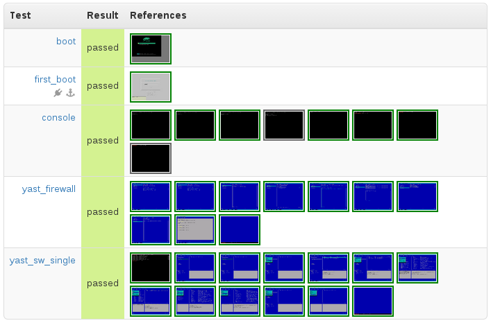

#Yast openQA Tests

This is a Yast "distri" for [openQA](https://github.com/os-autoinst)
These tests are created for installed system.

It's basically an extension of [os-autoinst-distri-opensuse]
(https://github.com/os-autoinst/os-autoinst-distri-opensuse)

##Directory Structure and Files

* File `main.pm` is THE entry point into all test. Although it has a `.pm`
  extension, it's actually a Perl script

* Particular tests are loaded using `loadtest($test)` subroutine and
  all are stored in `tests` directory

* Directory `our_needles` contain, so called, `needles` that consist of pairs
  screenshot.png + screenshot.json describing required matching areas of that
  screenshot and tags used for, e.g. check_screen() or assert_screen() in
  tests

##Installation

##openSUSE Libraries and Needles

Get the latest os-autoinst-needles-opensuse and corresponding needles
because openqa-yast is built on top of them

    cd /var/lib/openqa/tests

    # openSUSE tests
    mkdir opensuse && cd opensuse
    git clone git@github.com:os-autoinst/os-autoinst-distri-opensuse.git

    # openSUSE needles
    mkdir needles && cd needles
    git@github.com:os-autoinst/os-autoinst-needles-opensuse.git

##Yast tests

Clone `this` repository and opensuse into /var/lib/openqa/tests

    cd /var/lib/openqa/tests
    mkdir openqa-yast && cd openqa-yast
    git clone git@github.com:kobliha/openqa-yast.git

##Putting together

Create links to openSUSE needles and libs with a simple script

    cd /var/lib/openqa/tests/openqa-yast
    ./install_links.sh

In fact, just a little subset of `opensuse` libs and needles are needed,
but it's easier to keep them up to date just by fetching the lastest
ones from git instead of fixing them manually when something changes.

##Running Tests

The most common way is to create a new job using a pre-built hard-disk image
with HDD_1=hard-disk-image.qcow placed in /var/lib/openqa/factory/other
and also ISO=installation-image.iso placed in /var/lib/openqa/factory/iso
if you want to test some installation media features.

Example, run this on your openQA server

    /usr/share/openqa/script/client jobs post ARCH=x86_64 BACKEND=qemu BUILD=123 \
        DISTRI=openqa-yast TEST=openqa-yast VERSION=Tumbleweed \
        HDD_1=openSUSE-13.2-minimalx.qcow \
        ISO=Tumbleweed.iso
